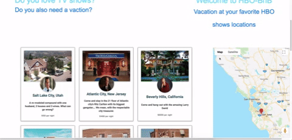

# HBO-BnB
[HBO-BnB live](https://hbo-bnb.herokuapp.com/#/)

HBO-BnB is a full-stack web application, inspired by AirBnB and some of HBO's most popular TV shows. It makes use of Ruby on Rails for its backend, PostgreSQL for its database and React.js and redux for the frontend.

While i am overall happy with the end results and managed to implement all the features i wanted to within the 10 days timeframe that was allotted for the project, I will get back to it at a later time to add some more features.

